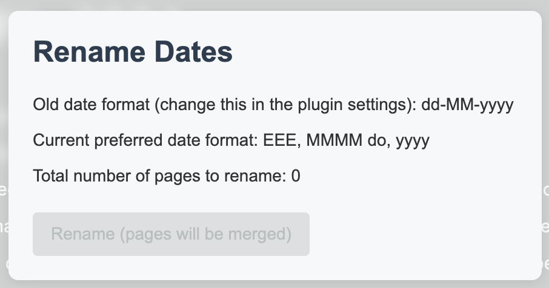

# Overview

Easily rename date pages when you change your preferred date format.

# Usage

1. Go to settings and key in the date format that you would like to change *from*. This would be the format that is being used in your graph now.
2. Click on the plugin icon, and you can see a list of pages that will be affected by the change.

3. Pages will be merged, i.e. content from the old page will be merged to the new one.
4. Re-index.

# Installation

Recommend to install from the marketplace. If not, download a release and manually load it in Logseq.
